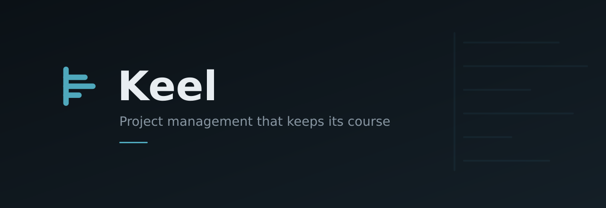

<p align="center">
  
</p>

<p align="center">
  <b>Project management that keeps its course</b>
</p>

<p align="center">
  Work items · Cycles · Modules · Roadmaps · Collaborative docs
</p>

<p align="center">
  <a href="https://keel.ostenmark.com"><b>keel.ostenmark.com</b></a> ·
  <a href="./docs/architecture.md">Architecture</a> ·
  <a href="./docs/migration-plan.md">Migration plan</a> ·
  <a href="./docs/branching.md">Contributing</a>
</p>

<p align="center">
  
  
  
  
</p>

---

## What it is

Keel tracks work. Items carry state, priority, assignees, labels, estimates and dates, nest into sub-items, and link to each other as blocking, duplicate or related.

|               |                                                                    |
| ------------- | ------------------------------------------------------------------ |
| **Cycles**    | Time-boxed sprints with burn-down tracking                         |
| **Modules**   | Durable groupings that cut across cycles                           |
| **Views**     | Saved filter, grouping and layout combinations — private or shared |
| **Pages**     | Collaborative rich-text docs, edited by several people at once     |
| **Intake**    | A triage inbox for requests before they reach the backlog          |
| **Analytics** | Charts across the whole workspace                                  |

Lists render as **list, board, calendar, spreadsheet or timeline**, grouped by any property.

## Architecture

Keel runs on **Vercel and Supabase only** — no VPS, no always-on server.

| Piece                                  | Runs on                               |
| -------------------------------------- | ------------------------------------- |
| `apps/web`, `apps/admin`, `apps/space` | Vercel — static SPA builds            |
| Postgres, Auth, Storage, RLS, Realtime | Supabase                              |
| API logic, scheduled and queued work   | Supabase Edge Functions, Cron, Queues |
| `apps/api` (Django)                    | Nowhere — reference-only              |

Full detail, including the one unsolved problem — collaborative editing without a stateful server — is in [docs/architecture.md](./docs/architecture.md).

## Repository layout

```
apps/
  web/        main application
  admin/      instance administration
  space/      public shared views
  live/       realtime collaboration server
  api/        Django — reference-only, not deployed
packages/     15 shared workspace packages (@keel/*)
supabase/
  migrations/ schema, versioned as SQL
docs/         working documentation
```

## Development

Requires **Node ≥ 22.18** and **pnpm 11.3**.

```bash
pnpm install
pnpm dev          # web:3000, admin:3001
pnpm build
pnpm check        # format, lint, types
pnpm fix          # auto-fix
```

Set `VITE_SUPABASE_URL` and `VITE_SUPABASE_PUBLISHABLE_KEY` to point at a Supabase project. Never put the **secret** key in a frontend build — Vite inlines env vars into the client bundle, and that key bypasses RLS.

Tooling is the **oxc** stack — `oxlint` and `oxfmt`, not ESLint or Prettier. Internal dependencies use `workspace:*`, external ones use `catalog:` from `pnpm-workspace.yaml`.

## Contributing

Two long-lived branches: `staging` for integration, `main` for production. Everything reaches `main` through a pull request. See [docs/branching.md](./docs/branching.md).

## Documentation

| Doc                                           | Contents                                   |
| --------------------------------------------- | ------------------------------------------ |
| [architecture.md](./docs/architecture.md)     | Target architecture and what replaces what |
| [migration-plan.md](./docs/migration-plan.md) | The phased migration off Django            |
| [branching.md](./docs/branching.md)           | Branch model, protection, deploys          |
| [brand.md](./docs/brand.md)                   | Identity — mark, wordmark, usage           |
| [linting.md](./docs/linting.md)               | Lint and format tooling                    |

## Origin and licence

Keel is a fork of **[Plane](https://github.com/makeplane/plane)** by Plane Software, Inc., used under the GNU Affero General Public License v3.0. Plane is an excellent piece of software and this project would not exist without it.

Keel is not affiliated with, endorsed by, or supported by Plane Software, Inc.

This project remains licensed under **[AGPL-3.0-only](./LICENSE.txt)**. Upstream copyright notices are preserved throughout the source.

Because Keel is served over a network, AGPL §13 obliges us to offer users the complete corresponding source of this modified version — which is this repository.
